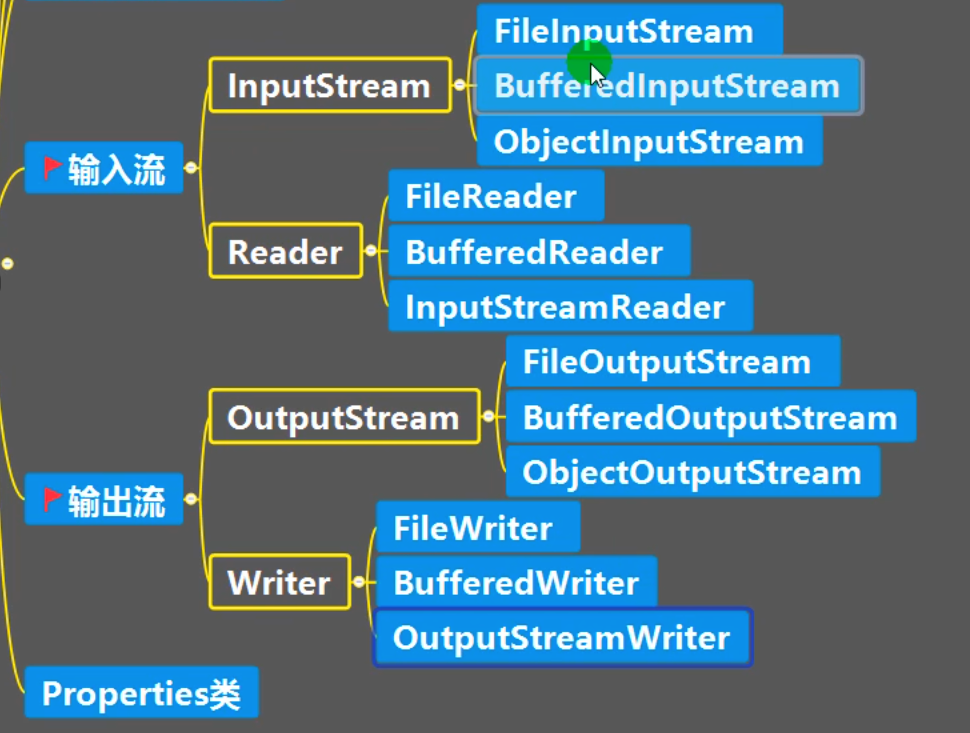
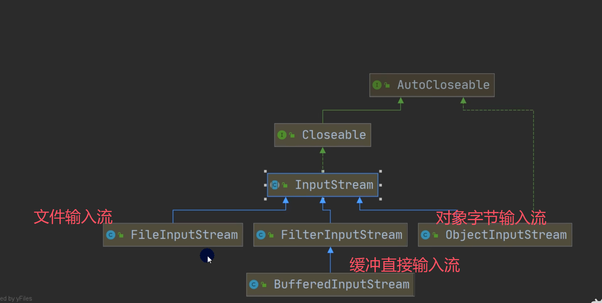
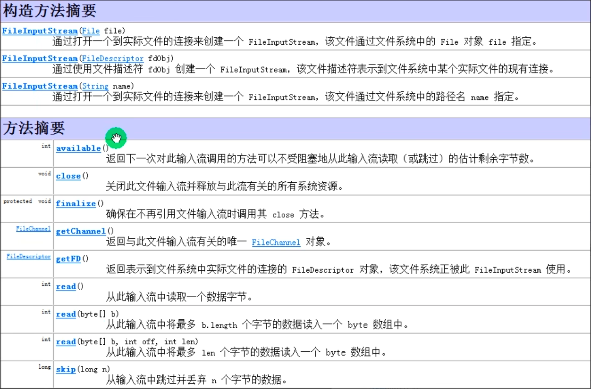
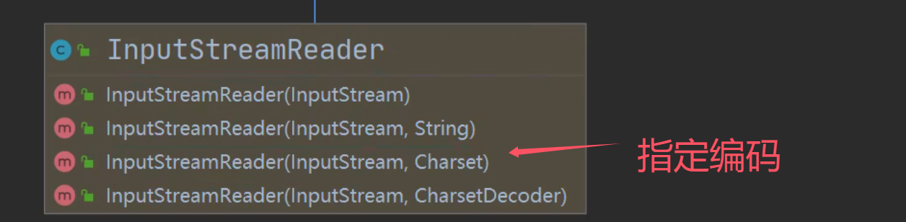

# IO流

## 1. 文件操作
### 1.1 新建文件
- new File(String pathname) // 根据路径创建File对象
- new File(File parent, String child) // 根据父目录和子路径创建File对象
- new File(String parent, String child) // 根据父目录和子路径创建File对象

### 1.2 获取文件信息
- getName()         // 获取文件名
- getAbsolutePath() // 获取绝对路径
- getParent()     // 获取父目录
- length()    // 获取文件大小
- lastModified() // 获取文件最后修改时间
- isFile() // 判断是否是文件
- isDirectory() // 判断是否是目录
- exists() // 判断文件是否存在
- mkdir() // 创建目录
- mkdirs() // 创建多级目录
- delete() // 删除文件或者空目录

## 2. IO流
- I/O是Input/Output的缩写，即输入/输出。用于处理数据。
- java程序中，对于数据的输入/输出操作以“流stream”的方式进行。
- java.io包下提供了各种流的类，用于处理数据，并通过方法输入或输出数据。
### 2.1 流的分类
- 操作数据单位：字节流、字符流
- 数据流向：输入流、输出流
- 流的角色：节点流、处理流/包装流

| (抽象基类) | 字节流       | 字符流 |
| ---------- | ------------ | ------ |
| 输入流     | InputStream  | Reader |
| 输出流     | OutputStream | Writer |



### 2.2 File

#### 2.2.1 FileInputStream



#### 2.2.2 FileReader

- new FileReader(File file) // 创建一个读取文件的字符输入流
- new FileReader(String fileName) // 创建一个读取文件的字符输入流
- read() // 读取一个字符
- read(char[] cbuf) // 读取多个字符
- new String(char[] cbuf) // 将字符数组转换为字符串
- new String(char[] cbuf, int off, int len) // 将字符数组的一部分转换为字符串

#### 2.2.3 FileWriter
- new FileWriter(File file) // 创建一个写入文件的字符输出流
- new FileWriter(File file, boolean append) // 创建一个写入文件的字符输出流，并且是追加模式
- new FileWriter(String fileName) // 创建一个写入文件的字符输出流
- write(char[] cbuf) // 写入字符数组
- write(String str) // 写入字符串
- write(String str, int off, int len) // 写入字符串的一部分
- write(int) // 写入一个字符
- 补充：String.toCharArray() // 将字符串转换为字符数组
**注意：FileWriter使用后，必须关闭(close) 或 刷新(flush) ,否则写入不到指定的文件**

### 2.3 Buffered （包装流）

#### 2.3.1 BufferedReader

- new BufferedReader(new FileReader(filePath)); // 创建一个带缓冲的读取文件的字符输入流
- readLine() // 读取一行

#### 2.3.2 BufferedWriter
- new BufferedWriter(new FileWriter(filePath)); // 创建一个带缓冲的写入文件的字符输出流
- new BufferedWriter(new FileWriter(filePath),true); // 创建一个带缓冲的以追加的方式写入文件的字符输出流
- write(String str) // 写入字符串
- write(String str, int off, int len) // 写入字符串的一部分
- write(char[] cbuf) // 写入字符数组
- newline() // 写入一个换行符

### 2.4 Object

-  序列化 ： 在保存数据时，保存数据的值和数据类型

- 反序列化：在恢复数据时，恢复数据的值和数据类型

- 需要让某个对象支持序列化机制，则必须让其类是可序列化的，为了让某个类是可序列化的，该类必须实现如下两个接口之一：
    - Serializable
    - Externalizable 

```java
        String filePath = "./learn_IO/src/data.txt";

        ObjectOutputStream objectOutputStream = new ObjectOutputStream(new FileOutputStream(filePath));

        objectOutputStream.writeInt(100);
        objectOutputStream.writeBoolean(true);
        objectOutputStream.writeChar('a');
        objectOutputStream.writeDouble(3.1415926);
        objectOutputStream.writeUTF("你好,我喜欢你");
```

```java
        String filePath = "./learn_IO/src/data.txt";

        ObjectInputStream ois = new ObjectInputStream(new FileInputStream(filePath));

        // 读取（反序列化）的顺序需要和你保存数据（序列化）的顺序一致，否则会出现异常

        System.out.println(ois.readInt());
        System.out.println(ois.readBoolean());
        System.out.println(ois.readChar());
        System.out.println(ois.readDouble());
        System.out.println(ois.readUTF());
        Object o = ois.readObject();
        System.out.println(o);

        ois.close();
```

`注意`

1) 读写顺序要一致
2) 要求实现序列化或反序列化对象，需要实现Serializable
3) 序列化的类中建议添加SerialVersionUID,为了提高版本的兼容性
4) 序列化对象时，默认将里面所有属性都进行序列化，但除了static?或transient修饰的成员
5) 序列化对象时，要求里面属性的类型也需要实现序列化接口
6) 序列化具备可继承性，也就是如果某类已经实现了序列化，则它的所有子类也已经默认实现了序列化

### 2.5 标准输入输出流

|                     | 类型        | 默认设备 |
| ------------------- | ----------- | -------- |
| System.in 标准输入  | InputStream | 键盘     |
| System.out 标准输出 | PrintStream | 显示器   |

- System.in
    - 编译类型  InputStream
    - 运行类型 BufferedInputStream
- System.out
    - 编译类型 PrintStream
    - 运行类型 PrintStream

### 2.6 转换流

#### 2.6.1 InputSteamReader

可以将字节流包装为字符流



```java
        String filePath = "./public/he.txt";
        // 指定编码
        InputStreamReader inputStreamReader = new InputStreamReader(new FileInputStream(filePath),"UTF-8");

        // 把 inputStreamReader 传入 BufferedReader
        BufferedReader bufferedReader = new BufferedReader(inputStreamReader);

        System.out.println(bufferedReader.readLine());

        bufferedReader.close();
```


#### 2.6.2 OutputSteamWriter

```java
    public static void main(String[] args)  throws Exception{
        String filePath = "./learn_IO/src/data1.txt";
        OutputStreamWriter outputStreamWriter = new OutputStreamWriter(new FileOutputStream(filePath),"utf8");
        outputStreamWriter.write("我喜欢你");
        outputStreamWriter.close();
        System.out.println("写入完毕(utf_8)");
    }
```

### 2.7 Properties类

常见方法:

- Ioad:加载配置文件的键值对到Properties对象
- list:将数据显示到指定设备
- getProperty(key):根据键获取值
- setProperty(key,value):设置键值对到Properties对象
- store:将Propertiesr中的键值对存储到配置文件，在idea中，保存信息到配置文件，如果
    含有中文，会存储为unicode码

```java
        // 使用Properties 类来读取test.properties文件

        // 1. 创建Properties 对象
        Properties properties = new Properties();

        // 2. 加载指定配置文件
        properties.load(new FileReader("./learn_IO/test.properties"));

//        properties.list(System.out);

        String user = properties.getProperty("I");
        System.out.println(user);
```


 ```java
         // 使用Properties类来创建配置文件，修改配置文件内容
 
         Properties properties = new Properties();
 
         properties.setProperty("charset", "utf-8");
         properties.setProperty("xiaoqi","xihuanni");
         properties.setProperty("age", "18");
 
 		// 第二个参数代表注释
         properties.store(new FileOutputStream("./learn_IO/test2.properties"),null);
 ```

