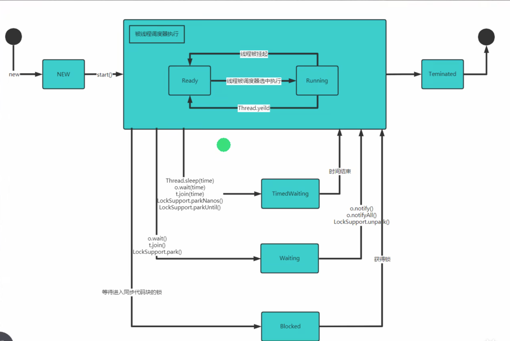

# 多线程

## 1.相关概念
### 1.1 进程
- 进程是指运行中的程序
- 进程是程序的一次执行过程，或是正在运行的一个程序。是动态过程：有他自身的产生、存在和消亡过程
### 1.2 线程
- 线程是进程的子集，是比进程更小的执行单位，是动态的、并发的、有优先级的，是静态的、串行的。 
### 1.3 并发
- 同一个时刻，对个任务交替进行，即多个任务同时发生，但只能一个一个地执行，不能同时执行。
### 1.4 并行
- 同一个时刻，多个任务同时执行。

## 2. 线程的创建
1. 继承Thread类
    
2. 实现Runnable接口

## 3.线程常用方法
- setName //设置线程名称
- getName //获取线程名称
- start //启动线程
- run //调用线程对象的run()方法
- setPriority //设置优先级
- getPriority //获取优先级
- sleep //让当前线程暂停一段时间
- interrupt //中断线程（使该线程阻塞状态，抛出InterruptedException异常）

- yield //让出cpu,让其他线程执行，但礼让的时间不确定，也不一定能让出来
- join //线程的插队。插队后，插队线程执行完毕后，再执行当前线程

- T.setDaemon(true) // 设置为守护线程

1. 用户线程：也叫工作线程，当线程的任务执行完成或通知方式结束
2. 守护线程：一般是为工作线程服务的，当所有的用户线程结束，守护线程也会结束
3. 常见的守护线程：垃圾回收机制
## 4. 线程的声明周期

## 5.线程同步机制
- 在多线程编程中，一些线程需要访问同一资源，为了避免多个线程同时访问同一资源，从而导致数据不一致，需要使用同步机制。
- 线程同步，即当有一个线程在对内存进行操作时，其他线程都不可以对这个内存地址进行操作，直到该线程完成操作，其他线程才能对该内存地址进行操作。
 
### 5.1 实现方式
```java
synchronized (对象){ // 得到对象的锁，才能操作同步代码
    // 需要被同步的代码
}

```
```java
// 整个方法都是要同步的内容
public synchronized void m(){
    // 需要被同步的代码
}
```

## 6. 释放锁的情况
- 线程执行完同步代码块，自动释放锁
- 当前线程在同步代码块、同步方法中遇到break,return
- 当前线程在同步代码块、同步方法中出现了未处理的Error或Exception，导致异常结束
- 当前线程在同步代码块、同步方法中执行了线程对象的wait()方法，当前线程暂停，并释放锁

`不会释放锁的情况`
- 线程执行同步代码块或同步方法时，程序调用Thread.sleep()、Thread.yield()方法暂停当前的线程
- 线程执行同步代码块时，其他线程调用了该线程的suspend()方法将该线程挂起
