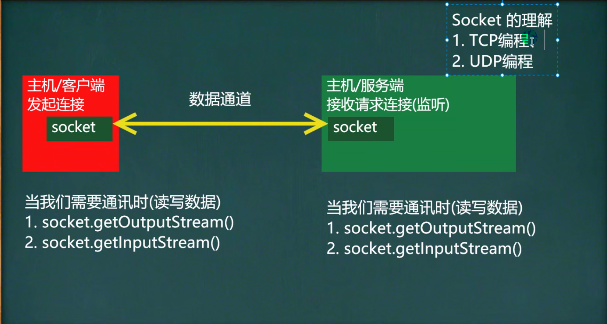

# 网络编程

## 1.InetAdderss类

- getLocalHost 	获取本机inetAdderss对象
- getByName       根据指定主机名/域名获取ip地址对象
- getHostName    获取InetAddress对象的主机名 
- getHostAddress   获取InetAddress对象的地址

## 2.Socket

### 2.1  介绍

- 套接字(Socket)开发网络应用程序被广泛采用，以至于成为事实上的标准

- 通信的两端都要有Socket,是两台机器间通信的端点

- 网络通信其实就是Socket间的通信

- Socket允许把网络连接当成一个流，数据在两个Socket间通过IO传输

- 一般主动发起通信的应用程序属客户端，等待通信请求的为服务端

    

